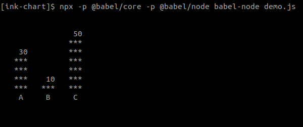

> Chart component for [Ink](https://github.com/vadimdemedes/ink)


## Install

```
$ npm install ink-chart
```


## Usage

```js
import React from 'react';
import {render} from 'ink';
import Chart from 'ink-chart';

const data = [
  { key: 'A', value: 30 },
  { key: 'B', value: 10 },
  { key: 'C', value: 50 }
];

render(
	<Chart data={data} type'bar'/>
);
```


## API

### `<Chart/>`

#### data

Type: `array`

List with the data to display.

#### type

Type: `string`

Type of the chart, e.g. 'bar', 'pie', and other types supported by [ervy](https://www.chunqiuyiyu.com/ervy/#started)

#### options

Type: `object`


Any options allowed in [ervy](https://github.com/chunqiuyiyu/ervy)


## License

MIT © [Vít Stanislav](https://github.com/slaweet)
